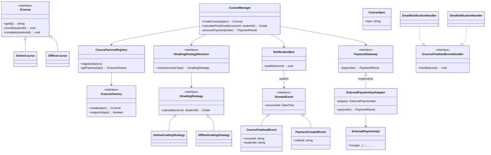

# Задание 1. Управление онлайн-курсами

## Краткий анализ исходной системы

Исходная реализация построена вокруг класса `CourseManager`, который:
- создает курсы разных типов через условные конструкции (`if/else new OnlineCourse/OfflineCourse`);
- хранит данные о курсах/пользователях;
- рассчитывает итоговую оценку в одном фиксированном методе;
- отправляет уведомления прямо из бизнес-методов (`sendEmail(...)`);
- выполняет оплату через прямой вызов внешнего API.

### Какие проблемы из списка присутствуют

1. **Разнородные обязанности в одном классе**: бизнес-логика, уведомления, работа с внешними сервисами и расчет оценки находятся вместе.
2. **Создание курсов через `if/else` и зависимость от конкретных реализаций**: при добавлении нового типа курса нужно менять `CourseManager`.
3. **Алгоритм расчета оценки жестко зафиксирован**: изменить правила оценки без правок основного класса невозможно.
4. **Уведомления встроены в бизнес-логику**: добавление нового канала уведомлений требует изменений бизнес-кода.
5. **Интеграция с платежом напрямую завязана на конкретный внешний API**: смена провайдера оплаты приводит к изменениям в бизнес-логике.
6. **Дублирование логики**: похожие действия выполняются в разных методах `CourseManager`.

## Требуемая цель (что улучшить)

Новая структура должна:
- разделить обязанности по отдельным классам/интерфейсам;
- убрать зависимость создания курсов от конкретных классов в `CourseManager`;
- сделать расчет оценки заменяемым (независимым от оркестрации);
- вынести уведомления из бизнес-методов;
- изолировать платежную интеграцию;
- минимизировать дублирование.

## Предложенная архитектура классов (расширяемая)

### Основная идея

`CourseManager` становится **оркестратором**: он координирует сценарии (регистрация, прохождение, финальная оценка, инициирование оплаты, отправка уведомлений через события), но не знает конкретных реализаций:
- курс создается через фабрику по типу (без `if/else` в `CourseManager`);
- оценка считается через внедряемую стратегию;
- уведомления реагируют на доменные события;
- платеж — через интерфейс-ворота с адаптером конкретного провайдера.

### UML (Mermaid)

## Описание основных классов и ответственности

- **`CourseManager`**: оркестрация сценариев. Получает спецификацию/события, вызывает компоненты и публикует доменные события (не отправляет уведомления напрямую и не дергает внешние API напрямую).
- **`CourseFactoryRegistry` + `ICourseFactory`**: расширяемая система создания курсов. Для нового типа добавляется новая реализация `ICourseFactory`, регистрируется в реестре (без правки `CourseManager`).
- **`IGradingStrategy`**: инкапсулирует алгоритмы расчета итоговой оценки. Конкретные стратегии (например, `OnlineGradingStrategy`) можно менять/добавлять независимо.
- **`IGradingStrategyResolver`**: выбирает подходящую стратегию по типу курса (или по контексту).
- **`NotificationBus` + обработчики доменных событий (`ICourseFinalizedEventHandler`)**: механизм уведомлений через обработчики доменных событий. Добавление нового канала (Email/SMS/Push) не требует изменения бизнес-сценариев.
- **`PaymentGateway` + `ExternalPaymentApiAdapter`**: “ворота” для оплаты. `CourseManager` работает с интерфейсом `PaymentGateway`, а адаптер изолирует конкретный внешний API.

## Соответствие проблемам и решениям (таблица)

| Проблема | Решение | Используемый паттерн | Обоснование |
|---|---|---|---|
| Разнородные обязанности в `CourseManager` | Разнести ответственность: фабрика создания курсов, стратегии оценки, шина событий для уведомлений, платежный gateway | **Observer**, **Strategy**, **Adapter**, **(Factory Method/Registry)** | `CourseManager` остается оркестратором и перестает содержать логику создания/уведомлений/интеграций/алгоритмов в одном месте. |
| Создание курсов через `if/else` и зависимость от конкретных классов | Убрать `if/else` из бизнес-логики: `CourseManager` получает `ICourseFactory` из `CourseFactoryRegistry` | **Factory Method** (через фабрики конкретных типов) | При добавлении нового типа курса добавляется новая реализация фабрики; существующий `CourseManager` не меняется. |
| Алгоритм расчета оценки жестко зафиксирован | Перенести расчет оценки в `IGradingStrategy`, выбор — через `IGradingStrategyResolver` | **Strategy** | Изменение правил оценки — это замена/добавление стратегии, без затрагивания оркестратора и бизнес-потока. |
| Уведомления встроены в бизнес-логику | Генерировать доменные события (`CourseFinalizedEvent`, `PaymentCreatedEvent`), а уведомления выполнять обработчиками | **Observer** | Канал уведомлений подключается через обработчики доменных событий (`ICourseFinalizedEventHandler`) и меняется независимо от бизнес-методов. |
| Работа с платежной системой напрямую завязана на внешний API | Ввести `PaymentGateway` и адаптер `ExternalPaymentApiAdapter` для конкретного провайдера | **Adapter** | Замена платежного сервиса означает замену адаптера, а бизнес не зависит от конкретных классов внешнего API. |
| Дублирование логики в разных методах | Свести похожие операции к общим компонентам/интерфейсам (gateway/factory/strategy/handlers) | **Strategy** и **Observer** (косвенно) | Общие операции выполняются в одном месте (например, единый интерфейс оплаты и единая точка выбора стратегии/обработчиков). |

## Вывод

Предложенная архитектура решает ключевые проблемы за счет разделения ответственности и внедрения расширяемых точек:
- создание курсов вынесено в фабрики (расширение без изменения `CourseManager`);
- расчет оценки заменяем стратегиями;
- уведомления реализованы через события и обработчики (без встраивания в бизнес-логику);
- платежная интеграция изолирована адаптером за интерфейсом `PaymentGateway`.

